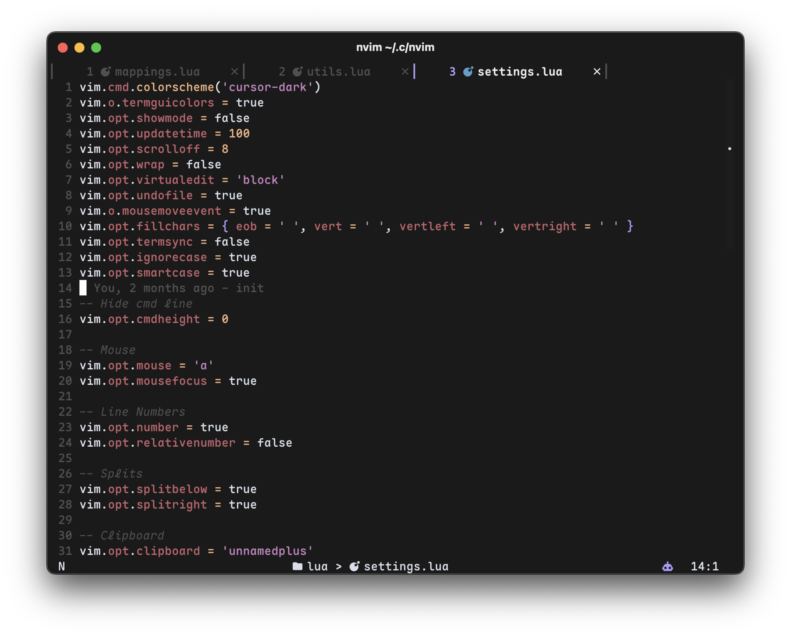

# Neovim Configuration

Just another neovim config.



## Features

- **Plugin Manager**: [lazy.nvim](https://github.com/folke/lazy.nvim) for fast and efficient plugin management
- **LSP Support**: Full Language Server Protocol integration with native Neovim LSP
- **Autocompletion**: [blink.cmp](https://github.com/Saghen/blink.cmp) for blazing-fast completions
- **AI Assistance**: [Supermaven](https://supermaven.com/) integration for AI-powered code suggestions
- **File Explorer**: [neo-tree.nvim](https://github.com/nvim-neo-tree/neo-tree.nvim) for intuitive file navigation
- **Fuzzy Finder**: [Telescope](https://github.com/nvim-telescope/telescope.nvim) for quick file and text search
- **Syntax Highlighting**: [nvim-treesitter](https://github.com/nvim-treesitter/nvim-treesitter) for accurate syntax highlighting
- **Git Integration**: [gitsigns.nvim](https://github.com/lewis6991/gitsigns.nvim) for Git decorations and hunks
- **Status Line**: [lualine.nvim](https://github.com/nvim-lualine/lualine.nvim) for a beautiful and informative status line
- **Tab/Buffer Management**: [barbar.nvim](https://github.com/romgrk/barbar.nvim) for elegant buffer tabs
- **Debugging**: DAP (Debug Adapter Protocol) integration for debugging support
- **Code Formatting**: Automatic code formatting with conform.nvim
- **Linting**: nvim-lint for real-time code linting
- **Scrollbar**: [nvim-scrollbar](https://github.com/petertriho/nvim-scrollbar) for visual scrollbar with diagnostics
- **Search Enhancement**: [nvim-hlslens](https://github.com/kevinhwang91/nvim-hlslens) for better search highlighting
- **Git Conflict Resolution**: [git-conflict.nvim](https://github.com/akinsho/git-conflict.nvim) for resolving merge conflicts
- **Lazygit Integration (via Snacks)**: [Snacks.nvim](https://github.com/folke/snacks.nvim) for a better git experience

## Structure

```
.
├── init.lua                 # Entry point
├── lua/
│   ├── plugins/
│   │   ├── init.lua        # Plugin manager setup
│   │   ├── themes.lua      # Color scheme configuration
│   │   ├── lsp.lua         # LSP configuration
│   │   ├── blink.lua       # Completion configuration
│   │   ├── telescope.lua   # Fuzzy finder setup
│   │   ├── treesitter.lua  # Syntax highlighting
│   │   ├── neotree.lua     # File explorer
│   │   ├── lualine.lua     # Status line
│   │   ├── barbar.lua      # Buffer/tab line
│   │   ├── gitsigns.lua    # Git integration
│   │   ├── debug.lua       # DAP configuration
│   │   ├── format.lua      # Formatting setup
│   │   ├── lint.lua        # Linting configuration
│   │   └── ...             # Other plugin configs
│   ├── mappings.lua        # Key mappings
│   ├── settings.lua        # Neovim settings
│   └── utils.lua           # Utility functions
└── assets/
    └── screenshot.png      # Screenshot
```

## Installation

### Prerequisites

- Neovim >= 0.9.0
- Git
- A [Nerd Font](https://www.nerdfonts.com/) for proper icon display
- ripgrep (for Telescope live grep)
- fd (for Telescope file finder)
- lazygit
- nvr (for Lazygit integration)

### Install

1. Backup your existing Neovim configuration (if any):

```bash
mv ~/.config/nvim ~/.config/nvim.backup
```

2. Clone this repository:

```bash
git clone git@github.com:catvitalio/nvim-config.git ~/.config/nvim
```

3. Start Neovim:

```bash
nvim
```

Lazy.nvim will automatically install all plugins on first launch.
